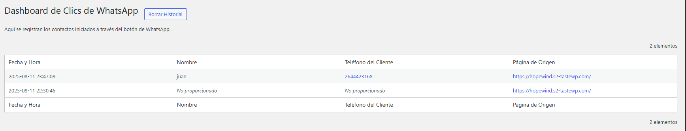

# Decor - Botón de WhatsApp para WordPress

 <!-- Opcional: Podés crear una imagen de cabecera y subirla al repo -->

**Versión:** 1.5.1  
**Autor:** [Juan](https://instagram.com/juanchisal10) de [Juvi | Automatizaciones web](https://instagram.com/juviweb)  
**Requiere WordPress:** 5.0 o superior  
**Probado hasta:** 6.2   
**Licencia:** GPLv2 or later  
**URI de la Licencia:** https://www.gnu.org/licenses/gpl-2.0.html

Un plugin simple y potente que añade un botón de WhatsApp flotante a tu sitio de WordPress. Incluye un formulario de captura de leads opcional y un dashboard interno para registrar todas las interacciones.

---

## ✨ Características Principales

Este plugin fue creado para ser una solución "todo en uno" para la integración de WhatsApp en WordPress, sin necesidad de herramientas externas.

*   **Botón Flotante Personalizable:** Añade un botón atractivo en la esquina inferior derecha de tu sitio.
*   **Ícono Personalizado:** Usa el ícono por defecto o sube el logo de tu propia marca para una integración perfecta.
*   **Formulario de Captura de Leads (Opcional):** Antes de redirigir a WhatsApp, muestra un formulario modal para capturar el nombre y teléfono del visitante.
*   **Dashboard Interno de Clics:** ¡No dependas de herramientas externas! Todos los contactos iniciados se registran en un dashboard dentro de tu panel de WordPress.
*   **Registro de Datos Útiles:** Guarda la fecha, hora, nombre, teléfono (proporcionado por el usuario) y la página de origen de cada contacto.
*   **Enlaces Directos a WhatsApp:** Desde el dashboard, haz clic en el número de teléfono de un cliente para abrir una conversación directamente.
*   **Liviano y Optimizado:** Código limpio y eficiente que no ralentizará tu sitio.

---

## 🛠️ Instalación

1.  **Descargar el Plugin:**
    *   Ve a la página de [Releases](https://github.com/Juvito25/whatsapp-plugin-decor/releases) de este repositorio.
    *   Descarga el archivo `.zip` de la última versión.

2.  **Subir a WordPress:**
    *   En tu panel de WordPress, ve a **Plugins > Añadir nuevo**.
    *   Haz clic en **"Subir plugin"**.
    *   Selecciona el archivo `.zip` que acabas de descargar y haz clic en **"Instalar ahora"**.
    *   Activa el plugin.

3.  **Instalación Manual (Alternativa):**
    *   Descarga y descomprime el archivo `.zip`.
    *   Sube la carpeta `decor-whatsapp` a tu directorio `/wp-content/plugins/` a través de un cliente FTP.
    *   Ve a la página de **Plugins** en tu panel de WordPress y activa "Decor - Botón de WhatsApp".

---

## ⚙️ Configuración

Una vez activado, encontrarás un nuevo menú en tu panel de WordPress llamado **"Decor WhatsApp"**.

1.  **Ajustes:**
    *   Ve a **Decor WhatsApp > Ajustes**.
    *   **Número de WhatsApp (Tuyo):** Ingresa tu número de teléfono completo, incluyendo el código de país (ej: `5491123456789`). Este es el número que recibirá los mensajes.
    *   **Ícono Personalizado:** Opcionalmente, puedes subir una imagen para reemplazar el ícono por defecto.
    *   Guarda los cambios.

2.  **Dashboard de Clics:**
    *   Ve a **Decor WhatsApp > Dashboard**.
    *   Aquí verás una tabla con todos los contactos que se han iniciado a través del botón.
    *   Puedes borrar el historial de clics si necesitas limpiar los registros de prueba.

---

## 🚀 Cómo Funciona

1.  Un visitante de tu sitio web hace clic en el botón flotante de WhatsApp.
2.  Aparece un formulario modal pidiendo su nombre y número de teléfono de forma opcional.
3.  Cuando el visitante hace clic en "Chatear ahora":
    *   La información (nombre, teléfono, página de origen, etc.) se guarda silenciosamente en tu base de datos de WordPress.
    *   El usuario es redirigido a la aplicación de WhatsApp para iniciar la conversación contigo.

---

## 🤝 Contribuciones

Este proyecto es de código abierto. Si quieres contribuir, por favor, sigue estos pasos:

1.  Haz un "Fork" del repositorio.
2.  Crea una nueva rama para tu funcionalidad (`git checkout -b feature/nueva-funcionalidad`).
3.  Haz tus cambios y realiza un "commit" (`git commit -am 'Añadida nueva funcionalidad'`).
4.  Sube tus cambios a la rama (`git push origin feature/nueva-funcionalidad`).
5.  Abre un "Pull Request".

---

## 📝 Historial de Cambios (Changelog)

**v1.5.1**
*   **CORRECCIÓN:** Se ha solucionado un aviso de PHP (`Undefined array key`) en el dashboard cuando se mostraban registros antiguos sin datos de nombre/teléfono.
*   **MEJORA:** El dashboard ahora muestra "No proporcionado" de forma amigable para los campos vacíos.

**v1.5.0**
*   **FUNCIONALIDAD:** ¡Captura de Leads! Se ha añadido un formulario modal para pedir el nombre y teléfono del usuario antes de redirigir.
*   **MEJORA:** La base de datos y el dashboard ahora almacenan y muestran el nombre y teléfono del cliente.
*   **MEJORA:** El número de teléfono en el dashboard ahora es un enlace directo a WhatsApp.

**v1.4.1**
*   **CORRECCIÓN:** Solucionado un error que impedía que los clics se guardaran correctamente.
*   **MEJORA:** Se ha añadido un botón para borrar el historial de clics en el dashboard.

... y así sucesivamente.